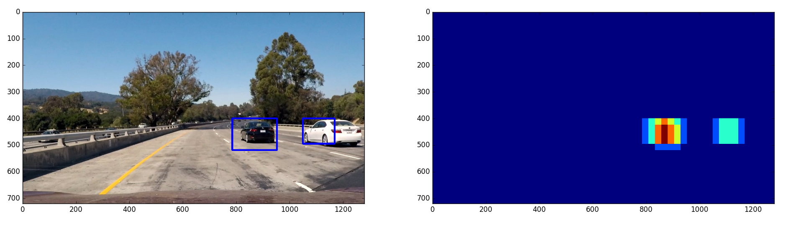
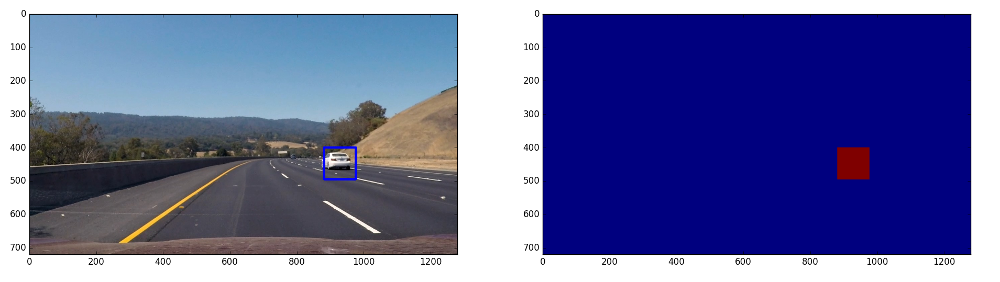
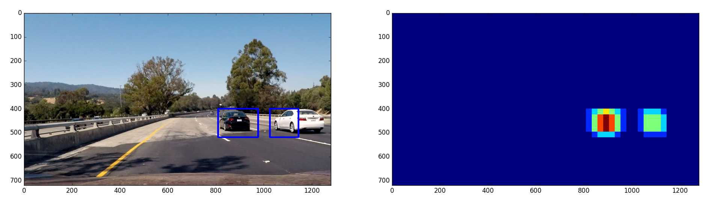
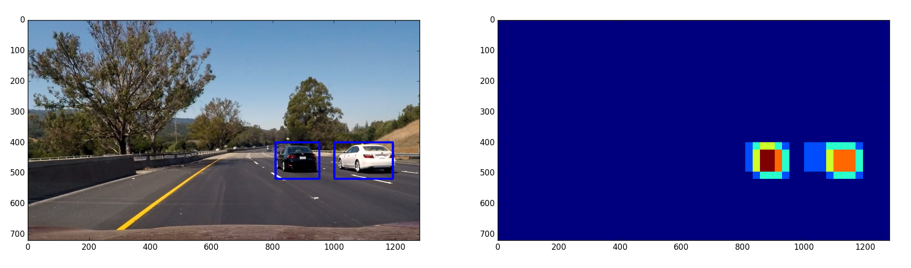
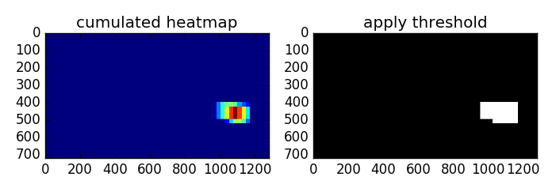
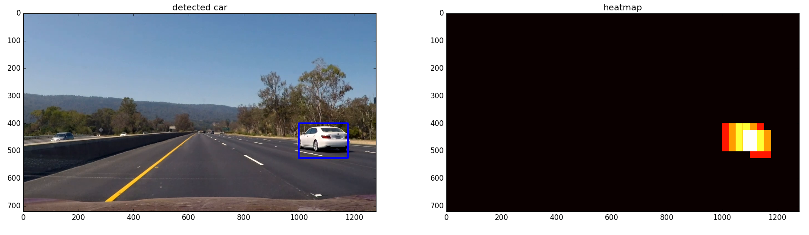

## Vehicle Detection

This is the project 5 of Udactiy self-driving car Term1. 

The goals / steps of this project are the following:

- [x] Perform a Histogram of Oriented Gradients (HOG) feature extraction on a labeled training set of images and train a classifier Linear SVM classifier
- [x] Apply a color transform and append binned color features, as well as histograms of color, to your HOG feature vector. 
- [x] Normalize your features and randomize a selection for training and testing.
- [x]  A sliding-window technique and use trained classifier to search for vehicles in images.
- [x] Run a pipeline on a video stream and create a heat map of recurring detections frame by frame to reject outliers and follow detected vehicles.

      ​

### Code Layout

- VehicleDetect/
  - FeatureExtraction.py
    - Feature extraction, include HOG, histogram, and spacial feature processes
  - CarDetet.py
    - function to find  cars in single frame 
  - CarDetectPipe.py
    - function to detect cars of current frame by past frames information
- Script
  - TrainCarDetect.py
    - Training Vehicle detection classifier
  - TestCarDetect.py
    - Test Vehicle detection classifier in test_images folder
  - CarDetectVidProc.py
    - process car detection in a video
  - VisualizeFeature.py
    - Visualize feature extraction, include HOG and histogram.

### Procedure and Pipeline of Vehicle Detection  

---
### Feature Extraction and Classifier:

Here, I used histogram of Oriented Gradients (HOG) and histogram of YUV image, plus spatial image in 32x32 size. Use these features to train in linear SVM.  I thought Y channel in YUV color domain is very useful of  HOG feature to classify cars. But I wonder the color information of HOG and spacial image is also useful too, so I  tried these feature combinations to experiment the linear SVM classifier. 

The best  accuracy in my experiment is about 99% in current dataset. 

So I  used HOG and histogam of YUV channel, plus spatial image with 32x32 size. 

|                       | Feature 1 | Feature 2       | Feature 3     | Accuracy |
| --------------------- | --------- | --------------- | ------------- | -------- |
| Feature combination 1 | HOG Y     | Spatial = False | Histogram YUV | 94.62%   |
| Feature combination 2 | HOG Y     | Spatial = True  | Histogram YUV | 97.75%   |
| Feature combination 3 | HOG YUV   | Spatial = True  | Histogram YUV | 99.07%   |

### Dataset 

 I used dataset from the course, which are the labeled data for [vehicle](https://s3.amazonaws.com/udacity-sdc/Vehicle_Tracking/vehicles.zip) and [non-vehicle](https://s3.amazonaws.com/udacity-sdc/Vehicle_Tracking/non-vehicles.zip) examples to train the classifier.  These example images come from a combination of the [GTI vehicle image database](http://www.gti.ssr.upm.es/data/Vehicle_database.html), the [KITTI vision benchmark suite](http://www.cvlibs.net/datasets/kitti/)

### Feature Extraction

The code for feature extraction is in VehicleDetecy/FeatureExtraction.py

- HOG feature in function "get_hog_features"
- Histogram feature in function "color_hist"
- spatial feature in function "bin_spatial"

You can also find feature extraction from single image and multi-images in function "single_img_features" and "extract_features" respectively.

#### 1. HOG features from the training images.

I started by reading in all the `vehicle` and `non-vehicle` images.  Here is an example of one of each of the `vehicle` and `non-vehicle` classes:


I then explored YUV color spaces and different `skimage.hog()` parameters (`orientations`, `pixels_per_cell`, and `cells_per_block`).  I grabbed random images from each of the two classes and displayed them to get a feel for what the `skimage.hog()` output looks like.

HOG parameters are `orientations=9`, `pixels_per_cell=(8, 8)` and `cells_per_block=(2, 2)`:


#### 2. HOG parameters.

I used the same HOG parameters as the course example, which have the pretty good result in car detection classifier

#### 3. Classifier of Car Detection

I used the following parameters of feature extraction:

```
#Define the colorspace
color_space = 'YUV' # Can be RGB, HSV, LUV, HLS, YUV, YCrCb
# Define HOG parameters
spatial_feat=True 
hist_feat=True
hog_feat=True
orient = 9
pix_per_cell = 8
cell_per_block = 2
hog_channel = "ALL" # Can be 0, 1, 2, or "ALL"
spatial_size = (32,32)
hist_bins = 32	
```

After combine the features from HOG, histogram and spatial images, I applied normalization within these features:

```
X_scaler = StandardScaler().fit(X)
# Apply the scaler to X
scaled_X = X_scaler.transform(X)
```

Then, I used the simple linear-SVM to train the car detection classifier.

```
# Use a linear SVC 
svc = LinearSVC()
```

### Sliding Window Search

I decided to search random window positions at random scales all over the image. The idea is showed like this image.


This is the search window scale from far to close position. I divided image into top, middle and bottom portion and searching the cars in different scale. Each portion are overlapped to smooth the search results.

```
# Top portion of ROI image
scale = 1.5
ystart = 400
ystop = 550
xstart = 400
xstop = 1208
bboxes1 = find_cars(img, xstart, xstop, ystart, ystop, scale,color_space, svc, X_scaler, orient, pix_per_cell, cell_per_block, spatial_size, hist_bins,hog_channel)
# Middle portion of ROI image
scale = 2.8
ystart = 450
ystop = 600
xstart = 400
xstop = 1208
bboxes2 = find_cars(img,  xstart, xstop,ystart, ystop, scale,color_space, svc, X_scaler, orient, pix_per_cell, cell_per_block, spatial_size, hist_bins,hog_channel)
# Bottom portion of ROI image
scale = 3.2
ystart = 500
ystop = 656
xstart = 400
xstop = 1208
bboxes3 = find_cars(img,  xstart, xstop, ystart, ystop, scale,color_space, svc, X_scaler, orient, pix_per_cell, cell_per_block, spatial_size, hist_bins,hog_channel)
```


#### 2. Examples of test images to demonstrate the pipeline

The pipeline to detection car in a frame is in TestCarDetect.py. 


Here are the detected and detected boxes heatmap of test images:










### Video Implementation

#### 1. Final video output.  
Here's a [link to my video result](./project_video_out.mp4)


#### 2. Filter for false positives and  combining overlapping bounding boxes.

I recorded the positions of positive detections in each frame of the video.  I accumulated  the positive detection from current frame to past 9 frames (used total 10 frames) to create a heatmap and then threashold the map to identify vehicle potition.  I then used `scipy.ndimage.measurements.label()` to identify individual blobs in the heatmap.  I then assumed each blob corresponded to a vehicle.  I constructed bounding boxes to cover the area of each blob detected.  

Here's an example result showing the heatmap from a series of frames of video, the result of `scipy.ndimage.measurements.label()` and the bounding boxes then overlaid on the last frame of video:

### Here are ten frames and their corresponding heatmaps:


### Here is the output of `scipy.ndimage.measurements.label()` on the integrated heatmap and apply label function from all ten frames:


### Here the resulting bounding boxes are drawn onto the last frame in the series:



---

### Discussion

From the result of the test video, I notice that the car sometimes detected only half instead of whole car. I thought the dataset could be augmented to create more car examples with more generality. Shifted, rotation or scale can be used to augment the dataset. 

Moreover, two cars overlapped in a car record video happens frequently. To separate cars in overlapping would apply the detection by car position in too close distance and also with tracking method. I just stopped the algorithm in detecting cars for now. But  if the tracking method  applied would have a better detection result to assist  self-driving algorithm.


